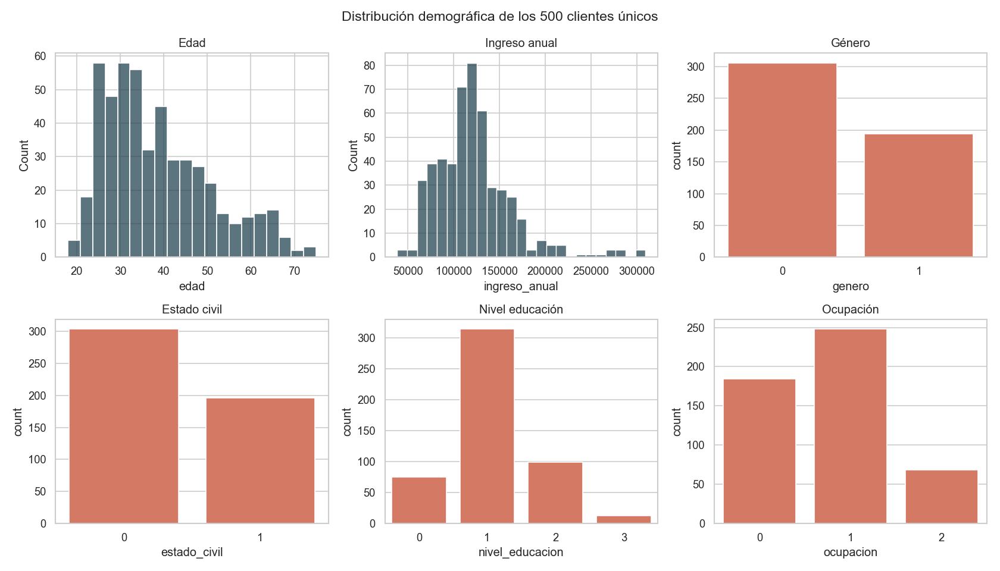
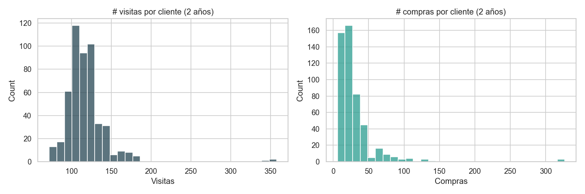
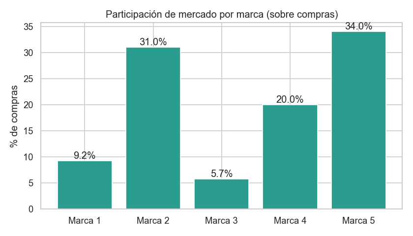
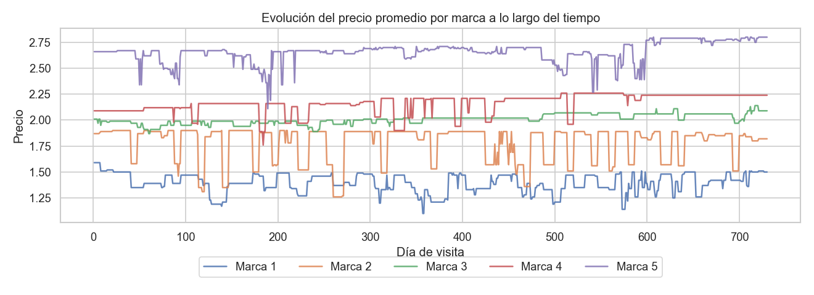
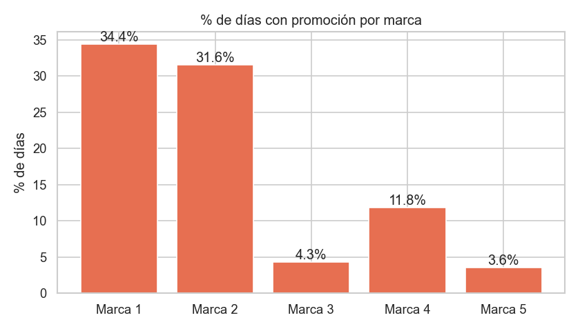
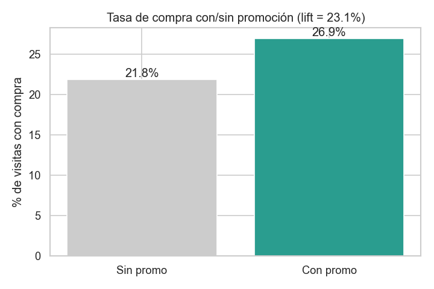
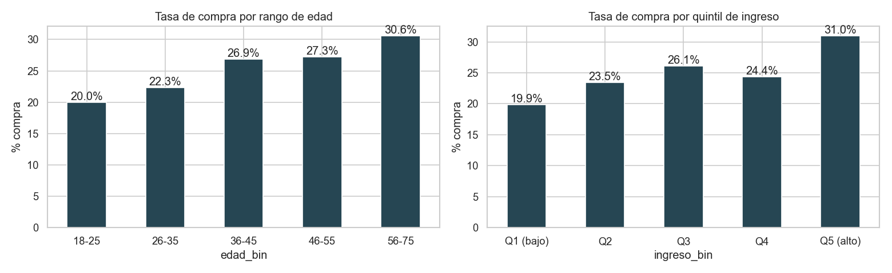
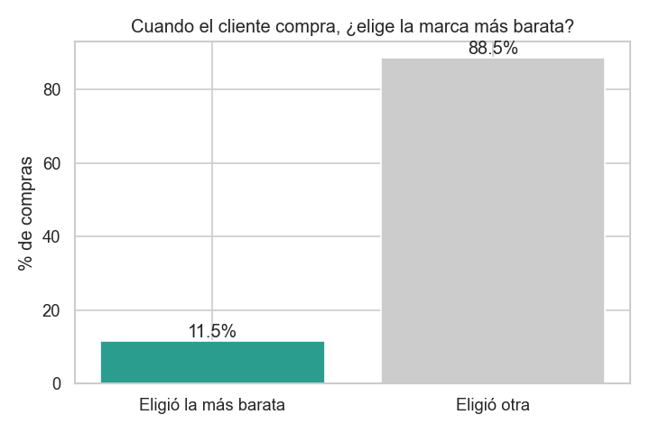
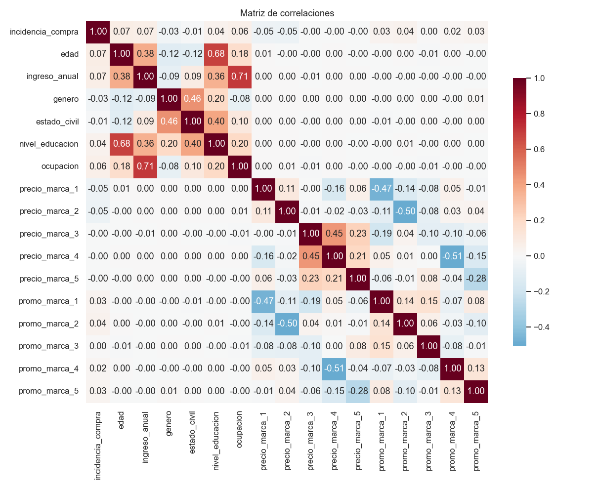
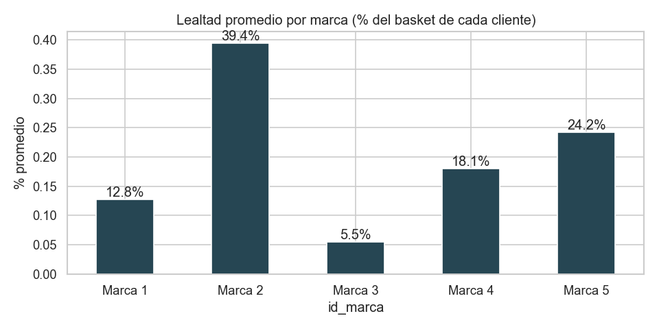

# Reporte EDA, Ferreycorp · Propensión de Compra

## 1. Visión general del dataset

| Métrica | Valor |
|---|---|
| Filas (visitas) | **58,693** |
| Columnas | 23 |
| Clientes únicos | **500** |
| Rango temporal | día 1 al día 730 (aprox. 2 años) |
| Visitas promedio por cliente | 117.4 |
| Compras promedio por cliente | 29.3 |
| **Tasa de conversión global** | **24.94%** |
| Valores nulos | 0 |

> La granularidad es **una fila igual a una visita de un cliente en un día**.
> El target `incidencia_compra` está moderadamente desbalanceado (aprox. 25% positivos),
> pero suficientemente representado como para no requerir oversampling agresivo.

## 2. Distribución demográfica

Los 500 clientes son adultos entre 18 y 75 años (mediana aprox. 36), con ingresos anuales entre 38k y 309k.
Nivel educativo y ocupación están codificados como ordinales o categóricas.

## 3. Comportamiento de visita y compra

Los clientes son recurrentes: en promedio 117 visitas en 2 años,
de las cuales 29 resultan en compra. Esto valida la formulación de
**propensión por visita** sobre propensión por cliente, ya que hay suficiente densidad temporal por individuo.

## 4. Marcas y participación de mercado

Las 5 marcas tienen participaciones muy distintas, dominadas por **Marca 5 (34.0%)** y **Marca 2 (31.0%)**.
La Marca 3 es claramente nicho (5.7%). Esto sugiere que un modelo
multiclase de marca tendría clases desbalanceadas, conviene tenerlo presente.

## 5. Precios y promociones

Los precios fluctúan en el tiempo, no son estáticos. Esto es **una palanca de pricing real**:
si entendemos elasticidad por marca, podemos sugerir cuándo bajar precio para activar
clientes de baja propensión.

**Lift de promoción:** la tasa de compra con al menos una marca en promo es **26.9%**
vs. **21.8%** sin promo (lift 23.1%).
Las promociones sí mueven la aguja, son una feature de primer orden para el modelo.

## 6. Demografía vs. tasa de compra

Hay diferencias entre rangos de edad y quintiles de ingreso, aunque ninguna es dramática.
Las features demográficas aportan, pero la señal principal está en el comportamiento histórico
y las palancas comerciales (precio y promo).

## 7. Sensibilidad a precio

Cuando un cliente compra, una proporción significativa elige la marca más barata disponible.
Esto refuerza la importancia de features como **precio relativo** y **descuento vs. promedio histórico**.

## 8. Correlaciones

Sin correlaciones bivariadas extremadamente fuertes con el target. Esto es típico en problemas
de propensión: la señal viene de **interacciones** (ej. cliente, precio y promo), donde los
modelos basados en árboles (LightGBM) funcionan mejor que los modelos lineales.

## 9. Lealtad de marca

Aproximadamente **89% de los clientes** concentran más del 50% de sus compras en una sola marca.
Esto valida construir feature de **lealtad histórica** y posiblemente segmentar clientes
en clústeres (leales vs. cazadores de oferta).

## 10. Hallazgos clave para modelado

1. **Granularidad correcta**: visita-cliente, modelo binario con `incidencia_compra` como target.
2. **Sin nulos**, no se requiere imputación.
3. **Variables categóricas**: `genero`, `estado_civil`, `nivel_educacion`, `ocupacion`, `id_marca`.
4. **Variables numéricas**: `edad`, `ingreso_anual`, precios y promos por marca.
5. **Feature engineering crítico** (debe calcularse con ventana causal, solo con datos `dia < dia_visita`):
   - **RFM**: recencia, frecuencia, monto promedio.
   - **Lealtad**: % histórico de compras por marca por cliente.
   - **Sensibilidad a promo**: tasa de compra del cliente cuando hay promo vs. cuando no.
   - **Precio relativo**: precio actual de cada marca dividido por el precio promedio histórico.
   - **Última marca y última cantidad**: ya vienen en el dataset.
6. **Validación temporal**: split por `dia_visita` (no random) para evitar leakage.
7. **Modelo principal**: LightGBM (maneja categóricas, captura interacciones, es rápido).
8. **Métrica de negocio**: Lift @ top-K, más útil que accuracy para campañas dirigidas.

---

*Generado automáticamente por `python -m src.eda`. Figuras en `docs/eda/figures/`.*
